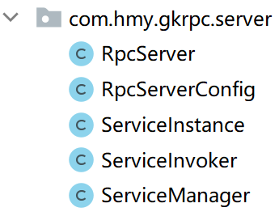
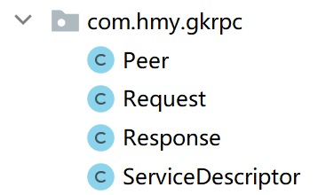

# 一个简单的RPC框架
实现了一个简单的RPC框架，不带有注册中心，提供的service存放在server上

**技术栈：**

序列化 —— fastjson

底层通信 —— 使用jetty完成

**实现功能：**

完成远程调用的功能

服务器启动监听端口，客户端发起远程调用获得结果

> 以下介绍中，方法 = service = 服务，即server能够提供的服务

# 模块
> server —— 服务端
> client —— 客户端
> proto —— 原型
> transport —— 网络传输
> codec —— 序列化
> common —— 工具类
> example —— 存放server提供的方法，同时可以测试效果

## server

服务端模块，负责注册service，等待client发起调用



> RpcServerConfig是配置类，存放网络协议、序列化协议、监听端口等信息
>
> ServiceManager管理server提供的service
>
> ServiceInvoker负责调用具体服务
>
> ServiceInstance存放的是service的实例对象和具体的方法
>
> RpcServer负责构建服务器，等待客户端发起调用请求，读取请求参数，根据请求参数调用相应的方法，并且将执行结果序列化返回给客户端

## client

客户端模块


> RpcClientConfig 配置类
>
> TransportSelector 选择指定的server进行链接，默认只有一个server，即 127.0.0.1:3000
>
> RandomTransportSelector 随机选择一个server进行链接
>
> RemoteInvoke 实现了 InvocationHandler，当要进行方法调用时，把参数封装到请求中，发起远程调用，交给serve进行处理，并且获得返回结果 
>
> RpcClient 实现RPC中的客户端，远程调用的发起者

## proto

原型模块



> 一些POJO
>
> Peer 网络传输中的端点，存储host和port信息
>
> Request 表示发送请求，存储需要调用的方法信息（ServiceDescriptor）和方法参数
>
> Response 表示返回结果，存储返回数据和状态码
>
> ServiceDescriptor 能够唯一描述一个方法，存储方法的class信息、方法名、返回值、参数类型

## transport

网络传输模块，使用HTTP进行传输，jetty捕获请求


> TransportClient 发起端，创建数据、发送数据等待响应、关闭链接
>
> TransportServer 接收端，启动和监听端口、接受请求、关闭监听
>
> RequestHandler 处理网络请求的handler

一个完整的请求的流程是这样的：

1. client根据调用的service方法和参数，构造HTTP请求，发送给指定端口
2. server监听指定端口，当有请求到达的时候，捕获请求，取出里面的请求数据
3. server根据请求方法名和方法参数，执行方法，获得返回结果，封装到response对象中，返回给客户端
4. 客户端等待执行完成，获取返回结果


## codec

序列化模块，使用fastjson进行序列化


## common

反射工具模块 


主要提供了以下三个静态方法


## example

测试效果


```java
public class Client {
    public static void main(String[] args) {
        RpcClient client = new RpcClient();
        CalcService service = client.getProxy(CalcService.class);
        // 远程调用，实际方法的执行发生在server
        int result = service.add(1, 2);
        System.out.println(result);
    }
}

// 控制台打印结果
19:16:57.673 [main] INFO  c.h.g.client.RandomTransportSelector - connect server:Peer(host=127.0.0.1, port=3000)
19:16:57.748 [main] INFO  c.hmy.transport.HttpTransportClient - URL: http://127.0.0.1:3000
3
```


# 调用流程

`Server`的准备工作

1. 准备好能够提供的服务，实例化服务对象，存放到hashmap中
2. 启动jetty容器，监听端口，等待请求发送，通过servlet捕获请求并做相应处理


`Client`调用`CalcService`的流程

1. 通过`getProxy`方法生成`CalcService`的代理对象
2. 通过代理对象执行方法，此时实际上执行的是代理对象中的`invoke`方法
3. 我们使用`RemoteInvoke`方法作为InvokeHandler的实现类，当调用`invoke`方法时，会构造`Request`对象，将我们想要调用的方法封装到`Servicedescriptor`中，记录请求参数，把这两个信息放到`Request`对象中，由`TransportClient`携带`Request`对象发起一个HTTP请求
4. `Server`使用jetty监听端口，当收到客户端发送的请求时，使用`RequestHandler`提取出请求信息，然后根据`Request`里面的`Servicedescriptor`信息，找到`CalcService`的实例，然后使用`Request`里面的方法参数进行方法执行，将返回结果封装到`Response`对象中，经过网络传输，将执行结果返回给`Client`
5. `Client`中获取返回结果，此时仍然存在于`RemoteInvoke`的`invoke`方法中，到这一步我们将获得`Response`对象，我们取出`Response`中的内容返回即可
6. `Client`执行结果符合预期，至此一个完成的RPC调用流程就结束了


## TODO

1. 增加注册中心，减轻服务器负担

2. 使用Netty作为网络传输模块，提升性能
